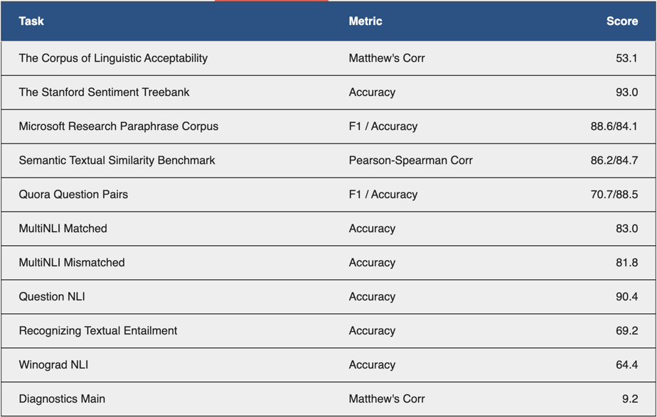

## Reproduce BERT results

#### 1. 数据集准备
- 该部分主要做bert-base在GLUE，NER上的复现工作
- GLUE数据集主要是在[GLUE Benchmark](https://gluebenchmark.com/tasks)上进行下载
- NER数据集可以从[Github](https://github.com/ningshixian/NER-CONLL2003/tree/master/data)上获取，然后运行NER中的preprocess.py进行一下相应的处理

#### 2. 复现
- 此处针对每个任务都创建一个项目文件进行复现工作，大部分代码相同，一些细节的地方不同任务代码稍有不同
- 需要训练则main中只留下train()，其余注释掉；需要预测则注释掉train()，运行其余代码，注意将ck_path替换为自己在验证集上效果最好的模型
- 所有任务使用pytorch-lightning进行开发

#### 3. 结果
- 复现结果如下，大部分差距不大，只有MNLI-m和MNLI-mm差距稍微大了一点，其中Diagnostics Main好像官网上也没给训练集和验证集，所以直接用它给的一个示例文件交上去了（这个可以忽略），其他均是自己跑的结果
- NER任务不清楚原论文使用的是哪种F1计算方式，这里使用sklearn的f1_score，设置average='micro'进行计算在验证集上能到98，测试集上结果为96.5

